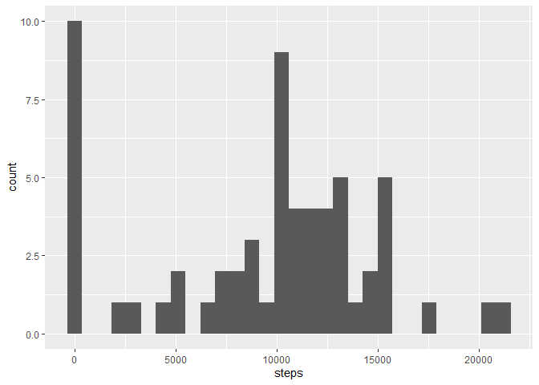
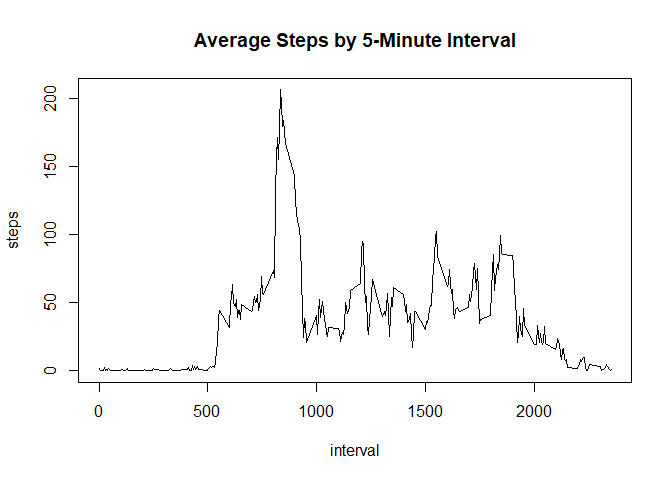
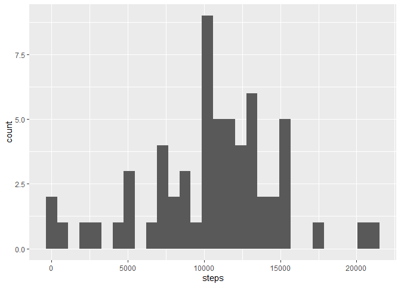
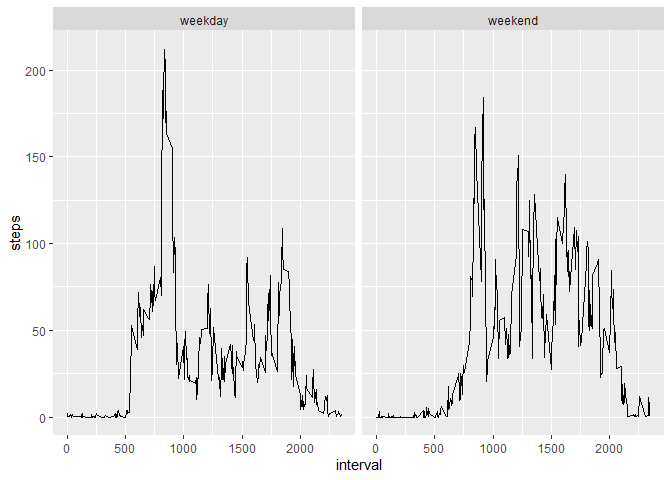

## Loading and preprocessing the data
First, I unzipped the data and loaded it into R using the read.csv() function. I also converted the "date" column into date format rather than character, to make it easier to work with:

```r
unzip("activity.zip")
activitydata <- read.csv("activity.csv")
activitydata$date <- as.Date(as.character(activitydata$date))
```


## What is mean total number of steps taken per day?

First, I loaded the ggplot2 and dplyr packages which will come in handy:

```r
library(ggplot2)
library(dplyr)
```

```
## 
## Attaching package: 'dplyr'
```

```
## The following objects are masked from 'package:stats':
## 
##     filter, lag
```

```
## The following objects are masked from 'package:base':
## 
##     intersect, setdiff, setequal, union
```

Then, I made a new table, dailysteps, from the total number of steps per day using the aggregate() function. I renamed the columns to "date" and "steps", then made a histogram of the total steps per day:

```r
dailysteps <- with(activitydata, aggregate(steps, list(date), sum, na.rm=TRUE))
dailysteps <- rename(dailysteps, date = Group.1, steps = x)
ggplot(dailysteps, aes(x=steps))+geom_histogram()
```

```
## `stat_bin()` using `bins = 30`. Pick better value with `binwidth`.
```

<!-- -->

Finally, I took the mean and median of the total number of steps per day:


```r
mean(dailysteps$steps, na.rm=TRUE)              
```

```
## [1] 9354.23
```

```r
median(dailysteps$steps, na.rm=TRUE)
```

```
## [1] 10395
```

## What is the average daily activity pattern?
I generated the data frame intervalsteps by taking the mean number of steps recorded for a given time interval, excluding missing values. Then, I made a line plot of this data to demonstrate daily activity trends by time interval:

```r
intervalsteps <- with(activitydata, aggregate(steps, list(interval), mean, na.rm=TRUE))
intervalsteps <- rename(intervalsteps, interval=Group.1, steps=x)
with(intervalsteps, plot(interval, steps, type="l"))
title(main = "Average Steps by 5-Minute Interval")
```

<!-- -->

The interval with the maximum number of steps on average can be found with the which.max() function, applied to the steps column of my data frame. This interval corresponds to the peak in the graph above.

```r
intervalsteps[which.max(intervalsteps[,2]),1]
```

```
## [1] 835
```

## Imputing missing values
There was a lot of missing data in this data set, as quantified here:


```r
sum(is.na(activitydata$steps))
```

```
## [1] 2304
```

I used the missForest() function to impute this missing data using the random forest sampling method. It's a pretty complicated algorithm, but the function in R is user friendly. I had to reformat the data frame first, to get the missing value out of the first columns. I also had to replace the output "date" column with our original date column to get it back to the date class (rather than numeric).


```r
library(missForest)
```

```
## Loading required package: randomForest
```

```
## randomForest 4.6-14
```

```
## Type rfNews() to see new features/changes/bug fixes.
```

```
## 
## Attaching package: 'randomForest'
```

```
## The following object is masked from 'package:dplyr':
## 
##     combine
```

```
## The following object is masked from 'package:ggplot2':
## 
##     margin
```

```
## Loading required package: foreach
```

```
## Loading required package: itertools
```

```
## Loading required package: iterators
```

```r
imputedactivity <- with(activitydata, cbind(interval, date, steps))
imputedactivity <- as.data.frame(missForest(imputedactivity)$ximp)
```

```
##   missForest iteration 1 in progress...done!
##   missForest iteration 2 in progress...done!
##   missForest iteration 3 in progress...done!
##   missForest iteration 4 in progress...done!
```

```r
imputedactivity$date <- activitydata$date
```

Finally, I updated our histogram, mean and median for total steps per day using this imputed data set:


```r
impdaily <- with(imputedactivity, aggregate(steps, list(date), sum))
impdaily <- rename(impdaily, date = Group.1, steps = x)
ggplot(impdaily, aes(x=steps))+geom_histogram()
```

```
## `stat_bin()` using `bins = 30`. Pick better value with `binwidth`.
```

<!-- -->

```r
median(impdaily$steps)
```

```
## [1] 10610.55
```

```r
mean(impdaily$steps)
```

```
## [1] 10482.2
```

## Are there differences in activity patterns between weekdays and weekends?
I used the ifelse() function to create a new column in our imputed data set, weekend. This is a factor variable that tells us whether a given recording occurred on a weekday or over the weekend:


```r
imputedactivity$weekend <- ifelse(weekdays(imputedactivity[,2]) %in% c("Saturday", "Sunday"),"weekend", "weekday") 
imputedactivity$weekend <- as.factor(imputedactivity$weekend)
```

Then, I took the average number of steps for a given time interval, separating observations from weekdays vs. weekend:

```r
impweekendsteps <- with(imputedactivity, aggregate(steps, list(interval, weekend), mean))
impweekendsteps <- rename(impweekendsteps, interval = Group.1, weekend = Group.2, steps=x)
```

Finally, I created a set of plots comparing steps taken over weekdays vs the weekend:

```r
ws <- ggplot(impweekendsteps, aes(interval, steps))
ws + facet_grid(.~weekend)+geom_line()                  
```

<!-- -->
